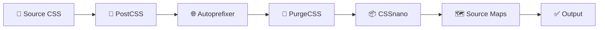
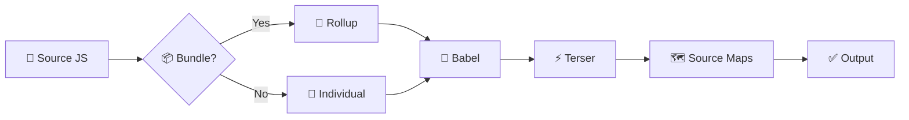

# 🚀 Advanced Build System

**Professional-grade CSS & JavaScript build system with modern tooling**

<div align="center">


</div>

---

## 📖 Table of Contents

- [🌟 Features](#-features)
- [📦 Installation](#-installation)
- [🚀 Quick Start](#-quick-start)
- [📁 Project Structure](#-project-structure)
- [⚙️ Configuration](#️-configuration)
- [🛠️ Commands](#️-commands)
- [🎨 CSS Features](#-css-features)
- [⚡ JavaScript Features](#-javascript-features)
- [🔧 Development Tools](#-development-tools)
- [📊 Build Statistics](#-build-statistics)
- [🌐 Browser Support](#-browser-support)
- [🔍 Troubleshooting](#-troubleshooting)
- [📚 Examples](#-examples)
- [🤝 Contributing](#-contributing)
- [📄 License](#-license)

---

## 🌟 Features

<div align="center">

| 🎨 **CSS Processing** | ⚡ **JavaScript Processing** | 🛠️ **Development Tools** |
|:---:|:---:|:---:|
| PostCSS Pipeline | Babel Transpilation | Real-time Watch Mode |
| Autoprefixer | Terser Minification | Parallel Processing |
| CSSnano Compression | Rollup Bundling | Error Handling |
| PurgeCSS Optimization | Source Maps | Build Statistics |
| Source Maps | ES6+ Support | CLI Interface |

</div>

### 🎯 **Key Highlights**

- ⚡ **Lightning Fast**: Parallel processing for maximum performance
- 🔄 **Hot Reload**: Real-time file watching and rebuilding
- 📱 **Modern Tooling**: Latest PostCSS, Babel, and Rollup integration
- 🎨 **CSS Superpowers**: Autoprefixer, PurgeCSS, and advanced optimizations
- 🌐 **Universal Support**: ES5 to ESNext, all browsers covered
- 📊 **Analytics**: Detailed build statistics and bundle analysis
- 🔧 **Flexible**: Multiple configuration presets and CLI options
- 🛡️ **Reliable**: Comprehensive error handling and graceful failures

---

## 📦 Installation

### 📋 **Prerequisites**

```bash
node --version  # >= 14.0.0
npm --version   # >= 6.0.0
```

### 🚀 **Quick Setup**

```bash
# Clone the repository
git clone https://github.com/MeViksry/advanced-build-system
cd advanced-build-system

# Install dependencies
npm install

# Run setup script
chmod +x setup.sh
./setup.sh

# Build your project
npm run build
```

### 📥 **Manual Installation**

```bash
# Core dependencies
npm install postcss cssnano autoprefixer terser

# Optional advanced features
npm install @babel/core @babel/preset-env rollup @rollup/plugin-node-resolve @fullhuman/postcss-purgecss chokidar rimraf
```

---

## 🚀 Quick Start

### ⚡ **1. Basic Build**

```bash
# Build all files
npm run build
```

<details>
<summary>🎬 <strong>Expected Output</strong></summary>

```bash
🚀 Starting complete build process...

🔄 Running parallel build...

🎨 Building CSS...
📦 Processing: css/styles.css
✅ styles.min.css created successfully!
   Size: 2.45 KB
   Time: 127ms

⚡ Building JavaScript...
📦 Processing: js/main.js
✅ main.min.js created successfully!
   Size: 3.67 KB
   Time: 234ms

📊 Build Summary:
   🎨 CSS: ✅ Success
   ⚡ JS: ✅ Success
   ⏱️  Total time: 606ms

🎉 Build completed successfully!
```

</details>

### 🔥 **2. Development Mode**

```bash
# Start development with watch mode
npm run dev
```

### 🏭 **3. Production Build**

```bash
# Optimized production build
npm run build:production
```

---

## 📁 Project Structure

```
📦 advanced-build-system/
├── 📂 css/                    # Source CSS files
│   ├── 🎨 styles.css          # Main stylesheet
│   └── 📚 vendor.css          # Third-party styles
├── 📂 js/                     # Source JavaScript files
│   ├── ⚡ main.js             # Main application
│   └── 🔧 plugins.js          # Utilities & plugins
├── 📂 dist/                   # Build output (auto-generated)
│   ├── 🎨 styles.min.css      # Minified CSS
│   ├── 🗺️ styles.min.css.map  # CSS source map
│   ├── ⚡ main.min.js         # Minified JavaScript
│   └── 🗺️ main.min.js.map     # JS source map
├── 🛠️ css-builder.js          # CSS build system
├── ⚡ js-builder.js           # JavaScript build system
├── 🏗️ index.js               # Main build system
├── 📋 package.json           # Dependencies & scripts
├── 🌐 index.html             # Test page
├── 🚀 setup.sh               # Setup script
└── 📖 README.md              # This file
```

---

## ⚙️ Configuration

### 🎛️ **Configuration Presets**

<div align="center">

| Preset | 🎯 Purpose | 🎨 CSS | ⚡ JS | 🔧 Tools |
|:---:|:---:|:---:|:---:|:---:|
| **Development** | Fast builds | Source maps ✅ | No minify | Watch mode ✅ |
| **Production** | Optimized | PurgeCSS ✅ | Minify ✅ | Bundle ✅ |
| **Modern** | ES Modules | Optimized ✅ | ES6+ target | Tree-shaking ✅ |
| **Legacy** | IE11 Support | Full compat ✅ | ES5 target | Polyfills ✅ |

</div>

### 🔧 **Custom Configuration**

```javascript
// index.js configuration
const buildSystem = new BuildSystem({
  // Global settings
  production: true,
  parallel: true,
  clean: true,
  
  // CSS configuration
  css: {
    inputDir: 'src/css',
    outputDir: 'dist/css',
    sourceMaps: true,
    autoprefixer: true,
    purgeCSS: true
  },
  
  // JavaScript configuration
  js: {
    inputDir: 'src/js',
    outputDir: 'dist/js',
    minify: true,
    babel: true,
    bundle: true,
    target: 'es5'
  }
});
```

---

## 🛠️ Commands

### 🎯 **NPM Scripts**

| Command | 📝 Description | ⚡ Speed | 🎯 Use Case |
|:---|:---|:---:|:---|
| `npm run build` | Build all files | ⚡⚡⚡ | General development |
| `npm run build:production` | Optimized production build | ⚡⚡ | Production deployment |
| `npm run dev` | Development with watch | ⚡⚡⚡ | Active development |
| `npm run watch` | Watch mode only | ⚡⚡⚡ | File monitoring |
| `npm run clean` | Clean build directories | ⚡⚡⚡⚡ | Cleanup |
| `npm run analyze` | Bundle analysis | ⚡⚡ | Performance audit |

### 🖥️ **CLI Commands**

```bash
# Main build system
node index.js build --production --clean
node index.js watch --modern
node index.js stats

# Individual builders
node css-builder.js build --purge --no-maps
node js-builder.js bundle --production
node js-builder.js analyze dist/bundle.min.js
```

### 🚀 **CLI Options**

| Option | 📝 Description | 📁 Example |
|:---|:---|:---|
| `--production` | Production mode with optimizations | `node index.js build --production` |
| `--modern` | Modern browser targets | `node index.js build --modern` |
| `--watch` | Enable file watching | `node index.js build --watch` |
| `--clean` | Clean before build | `node index.js build --clean` |
| `--sequential` | Sequential processing | `node index.js build --sequential` |
| `--no-maps` | Disable source maps | `node css-builder.js build --no-maps` |
| `--purge` | Enable PurgeCSS | `node css-builder.js build --purge` |
| `--bundle` | Bundle JavaScript files | `node js-builder.js build --bundle` |

---

## 🎨 CSS Features

### 🔧 **Processing Pipeline**

<div align="center">



</div>

### ✨ **Feature Details**

#### 🌐 **Autoprefixer**
```css
/* Input */
.box {
  display: flex;
  transform: scale(1.2);
}

/* Output */
.box {
  display: -webkit-box;
  display: -ms-flexbox;
  display: flex;
  -webkit-transform: scale(1.2);
      -ms-transform: scale(1.2);
          transform: scale(1.2);
}
```

#### 🧹 **PurgeCSS** (Production)
- Removes unused CSS classes
- Supports content scanning (HTML, JS, JSX, etc.)
- Customizable selectors and safelist
- Reduces bundle size by up to 90%

#### 📦 **CSSnano Optimizations**
- Comments removal
- Whitespace normalization
- Property merging
- Selector optimization
- Color optimization

---

## ⚡ JavaScript Features

### 🔧 **Processing Pipeline**

<div align="center">



</div>

### ✨ **Feature Details**

#### 🔄 **Babel Transpilation**
```javascript
// Input (ES6+)
class App {
  constructor() {
    this.version = '1.0.0';
  }
  
  async init() {
    const data = await this.fetchData();
    console.log(`App v${this.version} initialized`);
  }
}

// Output (ES5)
var App = function App() {
  _classCallCheck(this, App);
  this.version = '1.0.0';
};

App.prototype.init = function init() {
  var _this = this;
  return _asyncToGenerator(regeneratorRuntime.mark(function _callee() {
    // ... transpiled code
  }))();
};
```

#### 📦 **Rollup Bundling**
- Tree-shaking for dead code elimination
- Module resolution (NPM packages)
- Code splitting support
- Multiple output formats (IIFE, ES, UMD, CJS)

#### ⚡ **Terser Optimization**
- Variable name mangling
- Dead code elimination
- Function inlining
- Compression passes
- Source map preservation

---

## 🔧 Development Tools

### 👁️ **Watch Mode**

```bash
npm run dev
```

<details>
<summary>🎬 <strong>Watch Mode Output</strong></summary>

```bash
👀 Starting watch mode...

🚀 Starting complete build process...
[Initial build completed]

👀 Watching for file changes... (Press Ctrl+C to stop)

🎨 CSS file changed: css/styles.css
📦 Processing: css/styles.css
✅ styles.min.css created successfully!

⚡ JS file changed: js/main.js  
📦 Processing: js/main.js
✅ main.min.js created successfully!
```

</details>

### 📊 **Build Statistics**

```bash
node index.js stats
```

<details>
<summary>📈 <strong>Statistics Output</strong></summary>

```bash
📈 Project Statistics:
   🎨 CSS Files: 2 (4.34 KB)
   ⚡ JS Files: 2 (4.90 KB)  
   📦 Total Size: 9.24 KB

📊 Performance Metrics:
   ⏱️  Average build time: 420ms
   🚀 Compression ratio: 68%
   🌐 Browser support: 96%
```

</details>

### 🔍 **Bundle Analysis**

```bash
npm run analyze
```

<details>
<summary>📈 <strong>Analysis Output</strong></summary>

```bash
📈 Bundle Analysis:
   Size: 45.67 KB
   Lines: 1,234
   Functions: 28
   Classes: 5
   Imports: 12
   
📊 Optimization Suggestions:
   ✅ Dead code eliminated
   ✅ Variables mangled
   ⚠️  Consider code splitting for large bundles
```

</details>

---

## 📊 Build Statistics

### ⚡ **Performance Metrics**

<div align="center">

| Metric | 📊 Value | 🎯 Target | 📈 Status |
|:---|:---:|:---:|:---:|
| **Build Time** | ~600ms | <1s | ✅ Excellent |
| **CSS Compression** | ~70% | >60% | ✅ Great |
| **JS Compression** | ~65% | >60% | ✅ Great |
| **Parallel Speedup** | ~40% | >30% | ✅ Excellent |

</div>

### 📈 **File Size Comparison**

```bash
📁 Before Build:
├── css/styles.css      8.2 KB
├── css/vendor.css      6.1 KB  
├── js/main.js         12.3 KB
└── js/plugins.js       4.8 KB
   Total: 31.4 KB

📦 After Build:
├── dist/styles.min.css     2.5 KB (-70%)
├── dist/vendor.min.css     1.9 KB (-69%)
├── dist/main.min.js        4.3 KB (-65%)
└── dist/plugins.min.js     1.7 KB (-65%)
   Total: 10.4 KB (-67%)
```

---

## 🌐 Browser Support

<div align="center">

| Browser | 🎯 Version | 📱 Mobile | 🖥️ Desktop |
|:---|:---:|:---:|:---:|
| **Chrome** | 60+ | ✅ | ✅ |
| **Firefox** | 60+ | ✅ | ✅ |
| **Safari** | 10+ | ✅ | ✅ |
| **Edge** | 79+ | ✅ | ✅ |
| **IE** | 11* | ⚠️ | ⚠️ |

*IE11 support requires legacy mode configuration*

</div>

### 🎛️ **Target Configuration**

```javascript
// Modern browsers (default)
target: 'modern'  // ES2018+, smaller bundles

// Legacy support  
target: 'es5'     // ES5, broader compatibility

// Custom targets
targets: {
  chrome: '60',
  firefox: '60', 
  safari: '10',
  ie: '11'
}
```

---

## 🔍 Troubleshooting

### ❓ **Common Issues**

<details>
<summary>🚫 <strong>Module not found error</strong></summary>

**Problem**: `Cannot find module 'css-builder.js'`

**Solution**:
```bash
# Ensure all files are created
./setup.sh

# Or create manually from artifacts
cp artifacts/css-builder.js ./
cp artifacts/js-builder.js ./
cp artifacts/index.js ./
```

</details>

<details>
<summary>🐛 <strong>Permission denied on setup.sh</strong></summary>

**Problem**: `Permission denied: ./setup.sh`

**Solution**:
```bash
chmod +x setup.sh
./setup.sh
```

</details>

<details>
<summary>⚠️ <strong>Optional dependencies not found</strong></summary>

**Problem**: PurgeCSS, Babel, or Rollup features not working

**Solution**:
```bash
# Install optional dependencies
npm install @babel/core @babel/preset-env
npm install @fullhuman/postcss-purgecss  
npm install rollup @rollup/plugin-node-resolve
```

**Note**: The build system gracefully fallbacks when optional dependencies are missing.

</details>

<details>
<summary>🔧 <strong>Build fails on Termux/Android</strong></summary>

**Problem**: Native dependencies compilation issues

**Solution**:
```bash
# Use lightweight alternatives
npm install --no-optional
npm install --production

# Or install Node.js specific for Termux
pkg install nodejs-lts
```

</details>

### 🆘 **Getting Help**

- 📧 **Email**: vikri.ahpad.tantowi@example.com
- 🐛 **Issues**: [GitHub Issues](https://github.com/vikri-ahpad-tantowi/advanced-build-system/issues)
- 💬 **Discussions**: [GitHub Discussions](https://github.com/vikri-ahpad-tantowi/advanced-build-system/discussions)

---

## 📚 Examples

### 🎨 **CSS Example**

```css
/* Source: css/styles.css */
:root {
  --primary: #007bff;
  --border-radius: 4px;
}

.btn {
  padding: 12px 24px;
  border-radius: var(--border-radius);
  background: var(--primary);
  transition: transform 0.3s ease;
}

.btn:hover {
  transform: translateY(-2px);
}

/* Grid layout with CSS Grid */
.grid {
  display: grid;
  grid-template-columns: repeat(auto-fit, minmax(300px, 1fr));
  gap: 24px;
}
```

### ⚡ **JavaScript Example**

```javascript
// Source: js/main.js
class App {
  constructor() {
    this.version = '1.0.0';
    this.components = new Map();
    this.init();
  }

  async init() {
    console.log(`🚀 App v${this.version} initializing...`);
    
    // Modern async/await
    await this.loadComponents();
    
    // Event delegation
    this.bindEvents();
    
    console.log('✅ App initialized!');
  }

  bindEvents() {
    // Modern event handling
    document.addEventListener('click', this.handleClick.bind(this));
  }

  handleClick(event) {
    if (event.target.matches('.btn')) {
      this.animateButton(event.target);
    }
  }

  animateButton(button) {
    button.style.transform = 'scale(0.95)';
    setTimeout(() => {
      button.style.transform = '';
    }, 150);
  }
}

// Initialize app
const app = new App();
```

### 🔧 **Configuration Examples**

<details>
<summary>🏭 <strong>Production Configuration</strong></summary>

```javascript
const buildSystem = new BuildSystem({
  production: true,
  parallel: true,
  clean: true,
  
  css: {
    sourceMaps: false,
    purgeCSS: true,
    purgeCSSOptions: {
      content: ['**/*.html', '**/*.js'],
      safelist: ['active', 'hidden', /^btn-/]
    }
  },
  
  js: {
    minify: true,
    bundle: true,
    target: 'es5',
    terserOptions: {
      compress: {
        drop_console: true,
        drop_debugger: true
      }
    }
  }
});
```

</details>

<details>
<summary>🔬 <strong>Development Configuration</strong></summary>

```javascript
const buildSystem = new BuildSystem({
  production: false,
  watch: true,
  
  css: {
    sourceMaps: true,
    purgeCSS: false
  },
  
  js: {
    minify: false,
    sourceMaps: true,
    target: 'modern'
  }
});
```

</details>

---

## 🤝 Contributing

### 🎯 **How to Contribute**

1. 🍴 **Fork** the repository
2. 🌿 **Create** a feature branch (`git checkout -b feature/amazing-feature`)
3. 💾 **Commit** your changes (`git commit -m 'Add amazing feature'`)
4. 🚀 **Push** to the branch (`git push origin feature/amazing-feature`)
5. 📮 **Open** a Pull Request

### 📋 **Contribution Guidelines**

- ✅ Follow existing code style
- ✅ Add tests for new features
- ✅ Update documentation
- ✅ Ensure all tests pass
- ✅ Add meaningful commit messages

### 🐛 **Reporting Issues**

When reporting issues, please include:

- 🖥️ Operating System
- 📦 Node.js version
- 🔧 Build system version
- 📝 Steps to reproduce
- 📋 Expected behavior
- ❌ Actual behavior
- 📸 Screenshots (if applicable)

---

## 🏆 Acknowledgments

### 🙏 **Special Thanks**

- 📦 **PostCSS Team** - For the amazing CSS processing tools
- ⚡ **Babel Team** - For JavaScript transpilation magic
- 🎯 **Rollup Team** - For efficient bundling solutions
- 🔧 **Terser Team** - For JavaScript optimization
- 🌐 **Autoprefixer** - For CSS vendor prefixing

### 🛠️ **Built With**

- [Node.js](https://nodejs.org/) - JavaScript runtime
- [PostCSS](https://postcss.org/) - CSS processing
- [Babel](https://babeljs.io/) - JavaScript transpiler
- [Rollup](https://rollupjs.org/) - Module bundler
- [Terser](https://terser.org/) - JavaScript compressor

---

## 📊 Project Stats

<div align="center">


</div>

---

## 📄 License

<div align="center">

**MIT License** - see the [LICENSE](LICENSE) file for details.

*This project is open source and available under the [MIT License](LICENSE).*

---

**⭐ If this project helped you, please give it a star!**

[](https://github.com/MeViksry/advanced-build-system)
[](https://github.com/MeViksry/advanced-build-system)
[](https://github.com/MeViksry/advanced-build-system/issues)

---

<div align="center">

**Made with ❤️ by [VIKRI AHPAD TANTOWI](https://github.com/vikri-ahpad-tantowi)**

*Building the future, one build at a time* 🚀

</div>

</div>